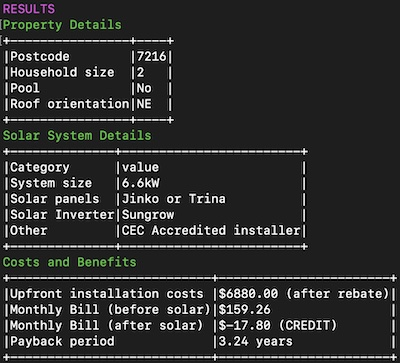
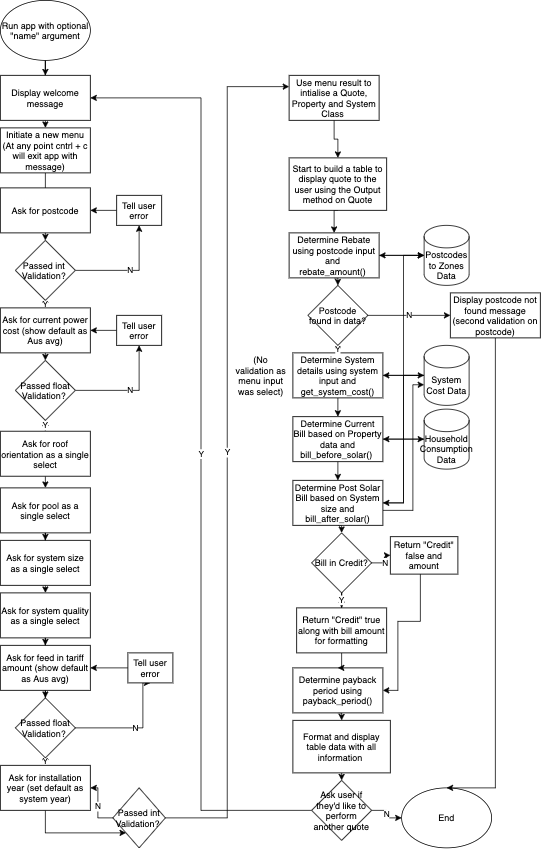

# Repository 

[Solar App](https://github.com/daviddigital/solarapp)

# Software Development Plan

## Statement of purpose and scope

## Overview

Solar App is a command line application that users can use to find out the costs and benefits of installing solar panels in Australia.

The app will take an address and other input data such as power usage and solar power system size, and determine the costs and savings after any available rebates available in the user's state.

## Scope

The scope of this App is for residential users in Australia who are making use of solar/carbon credits available to them, known as small-scale certificates (STCs).

Australian Energy Regulator data will be used along with average usage data. 

## Problem Statement

It can be hard to determine whether a solar system is worth the investment, and what size solar system to install.

Currently, individuals can reach out to installers for free quotes, but installers have an incentive to sign the customer and some solar installers can be pushy.

Online calculators exist for Solar but they can use confusing terminology and require a lot of input upfront like existing power bill information. Solar App is designed to be as user-friendly as possible, with only minimal data required and averages utilised from Government data.

## Target Audience
 
The primary intended user of the app are individuals interested in getting solar installed on their roof and want to perform a quick check as to whether the benefits outweigh the costs. A secondary user could be solar retailers who are preparing a quote for a client.

## Example Use Case

John is interested in getting solar on his roof and wants to find out the costs and benefits without needing to contact an installer.

John runs Solar App, which prompts John for the following inputs:

- What is the postcode of the property
- What is the installation year (defaulted to current year)
- Number of people at the property
- Solar System Size
- Solar System Quality
- Main roof orientation 
- Current power cost
- Feed In Tarif

Solar App outputs the following to John:

- The upfront cost for the solar system(s)
- Monthly power bill before and after solar
- Payback period

John is then presented with the option to calculate another quote, or exit the program. 

# Features 

## 1. Ability to enter information for a quote from a Menu

Solar App will take the following inputs via a menu which will assist in determining the costs and benefit outputs. 

- What is the postcode of the property
- What is the installation year (defaulted to current year)
- Number of people at the property
- Solar System Size
- Solar System Quality
- Main roof orientation 
- Current power cost
- Feed In Tariff

Error checking will be utilised to ensure clean data is captured, also single selects will be utilised rather than free-text input to reduce errors.

## 2. Ability to determine a solar system cost from inputs

After a user has entered information about the postcode and solar system required, Solar App will return a cost for the system after rebates.

The cost of the system is made up of the following components.

### Cost of the solar panels including installation

A JSON file will contain eight different system costs based on the quality input value (value for money or premium), and the size input value (6.6kW, 10kW, 15kW, 20kW)

### A rebate amount, based on small-scale technology certificates (STCs)

Per https://www.solargain.com.au/blog/everything-you-need-know-about-stcs STCs are calculated based on megawatt hours of renewable energy generated.

As more energy is generated in Cairns when compared to Hobart, Australia has different Zones for determining the number of STCs that can be claimed.

The following file will be converted into JSON and used by the app, in conjunction with system size and the years left until 2031 when the scheme ends to determine the rebate: http://www.cleanenergyregulator.gov.au/DocumentAssets/Pages/Postcode-zone-ratings-and-postcode-zones-for-solar-panel-systems.aspx

Example rebate: A 10kW system in postcode 4000 installed in 2020

10 * 1.382 * (2031-2021) = 138 STCs

$40 per STC, so 138 * $40 = $5520 rebate 

## 3. Ability to determine a households energy costs from inputs

Solar App will allow users to enter the number of adults in their household for Solar App to determine a monthly cost based on averages.

To determine the average cost based on household size and state, the following data will be utilised:

https://www.aer.gov.au/retail-markets/guidelines-reviews/electricity-and-gas-consumption-benchmarks-for-residential-customers-2020 

This Australian Energy Regulator report shows the average consumption of electricity by zone. This will be converted into a JSON file as the AER does not have an API available.

## 4. Ability to determine the bill before and after based on inputs

The bill before solar will utilise the household average energy based on the number of adults and whether a pool is at the property, and then multiply by the current power cost entered by the user in the menu.

The bill after solar will utilise the output rating based on zones at the postcode and multiply by the system size, and a roof orientation factor. If the amount is a surplus, a feed in tariff will be utilised to show the bill as a credit, as power is being exported to the grid. 

## 5. Ability to determine a payback period of a selected solar system size based on inputs, output all information in table format 

A payback period will be displayed to the user in a summary table along with system information and pre/post solar bills.

The payback period is calculated as the upfront cost / yearly savings. Yearly savings are calculated as the bill before solar less the bill after solar.

# Outline of the user interaction 

## Installation and running the app
Download or clone the github code and then run the below script to install the gem dependencies and run the app.

` bash run_app.sh `

Add your name or company name as a command line argument then running the app to get a personalised welcome message.

e.g. 

` ruby solarapp.rb "David"` 

## Using and interacting with features 

The user runs Solar App, which prompts the user for the following inputs:

- What is the postcode of the property
- What is the installation year (defaulted to current year)
- Number of people at the property
- Solar System Size
- Solar System Quality
- Main roof orientation 
- Current power cost
- Feed In Tariff

Solar App outputs the following to the user in a table:

- The upfront cost for the solar system(s)
- Monthly power bill before and after solar
- Payback period

The user is then presented with the option to calculate another quote, or exit the program. 

## Error handling

For the inputs, only the postcode, installation year, power cost and feed in tariff take free-text input. The other inputs are all single select to reduce the possibiltiy of an error.

For error handling on the free-text input, the type will be checked to match using the tty-prompt built-in validation, for example that power cost can resolve float. If the user enters a word "abc" in power cost, the prompt will let the user know that "abc" could not be converted into a float, and to try again.

There is additional validation on the postcode once processing the output to ensure that it is available in the data range. If it's not available, the user will be given a message that the postcode was not available, and to try again. 

# Control Flow Diagram

# Implementation Plan

A summary of the features and requirements are below, and also on the project kanban board https://github.com/daviddigital/solarapp/projects/1. 

## Create Data Files 

Convert all data sources (system prices, household consumption, and postcode to zones) to JSON format.

Checklist
- System prices JSON is created with each combination of size and quality (Priority: High)
- Household consumption JSON is created with each combination of swimming pool & household size (5+ is converted to 6) (Priority: High)
- Postcodes to zones is created (Priority: High)
- All JSON files follow JSON with no errors (Priority: High)
- Utilise test cases that access JSON data (Priority: High)

## Ability to enter information for a quote from a Menu

Initialise a menu, display a welcome message, and utilise tty prompt to capture all information required to generate a solar panel quote for the user.

Ensure error checking is implemented.

The information will be captured in a single hash to then use as an argument when initialising the Quote.

Checklist:
- Welcome message utilising command line arguments if provided (Priority: High)
- User friendly tty-prompt to collect all data required for a quote in the correct data type (Priority: High)
- Error checking/data validation on postcode, power cost, feed in tariff and installation year (Priority: High)
- Single select option on all other menu questions (Priortiy: High)
- Menu input data stored as a hash (Priority: High)
- Option to perform another quote (Priority: Medium)

## Create a a new quote and determine a solar system cost from inputs

Taking the user input from the menu, initiate a Quote (which also has a Property and SolarSystem class).

On the Solar System class, enable the ability to determine the system cost based on the system prices json file.

Checklist:
- A Quote is initialised with input from menu (Priority: High)
- A Property is initialised (Priority: High)
- A SolarSystem is initialised (Priority: High)
- Add the ability to determine system cost on the SolarSystem class using JSON data (Priority: High)
- Add the ability to determine rebate about on the Quote class using JSON data (Priority: High)

## Ability to determine a households energy costs and before bill from inputs

Taking user input from the menu, use the number of adults at the property and whether the property has a pool to determine the household kWh.

Multiply the kWh by the provided power costs to determine the current monthly bill. 

Checklist:
- Implement type conversion on inputs to match JSON file(Priority: High)
- Use number of adults and pool to determine household kWh (Priority: High)
- Create a method to pull the JSON data matching the user input (Priority: High)
- Create method to calculate current bill using kWh * power cost (Priority: High)
- Round to two decimal places (Priority: High)

## Ability to determine the bill after solar based on inputs

Taking input from the menu, use the system size, roof orientation and postcode code to determine the system output. 

Checklist:
- Implement type conversion on inputs to match JSON file (Priority: High)
- Use number of system size, roof orientation and postcode to determine generation kWh (Priority: High)
- Create a method to pull the JSON data matching the user input (Priority: High)
- Create method to calculate after solar bill using system output less current bill method (Priority: High)
- If there is excess (i.e. the bill will be a credit), calculate the credit using the feed in tarrif, return that the bill is in credit (Priority: High)

## Ability to determine a payback period of a selected solar system size based on inputs, output all information in table format 

Using the tty-progressbar and tty-table gems, display property, system and cost and benefit information in a table format. 

Checklist:
- Calculate payback period using upfront costs / yearly benefits (current bill less bill after solar)
- Display a loading bar using tty-progressbar (Priority: High)
- Display Property Details table using menu input (Priority: High)
- Display Solar System details table using menu input (Priority: High)
- Display system cost after rebate, bill before solar, bill after solar, payback period(Priority: High)
- Ask the user if they'd like to (Priority: High)

## Test

Test all major features using unit tests. 

Checklist:
- Menu initialise (Priority: High)
- Quote initialise (Priority: High)
- Property initialise (Priority: High)
- SolarSystem initialise (Priority: High)
- Major methods on each class above (Priority: High)

# Testing Outline

Each class was run with unit tests covering major features.

## Menu class (menu_test.rb)

Test a menu can be initialised. 

1 test, 1 assertion, 100% passed

## Quote class (quote_test.rb)

Test a quote can be initialised and full coverage of methods that are calculating system costs (cost and rebate) and benefits (bill before and after, payback period).

12 tests, 12 assertions, 100% passed

## Property class (property_test.rb)

Test a property can be initialised and full coverage of current bill method.

7 tests, 7 assertions, 100% passed

## Solar System class (solarsystem_test.rb)

Test a Solar System can be initialised and full coverage of generate sytem cost method.

6 tests, 6 assertions, 100% passed 

# References and data sources

Rebate calculation

CER. (2021, October 3). Postcode zone ratings and postcode zones for solar panel systems. Clean Energy Regulator. http://www.cleanenergyregulator.gov.au/DocumentAssets/Pages/Postcode-zone-ratings-and-postcode-zones-for-solar-panel-systems.aspx

Daily kwh per kw installed

Solar Quotes. (2021, September 9). What can I expect my solar system to produce, on average, per day? https://support.solarquotes.com.au/hc/en-us/articles/115002395494-What-can-I-expect-my-solar-system-to-produce-on-average-per-day-

Consumption per household

LG. (n.d.). What is the consumption in kWh for a typical Australian home? LG Energy. Retrieved October 3, 2021, from https://www.lgenergy.com.au/faq/buying-a-solar-system/what-is-the-consumption-in-kwh-for-a-typical-australian-home

Consumption for pool

Astbury, H. (2021, May 1). Swimming pool electricity usage explained. Canstar Blue. https://www.canstarblue.com.au/electricity/how-much-energy-does-a-swimming-pool-use/

Roof orientation factor

SolarQuotes. (2021, March 26). Which Solar Panel Direction (Orientation) Is Best? https://www.solarquotes.com.au/panels/direction/

Average power cost of $0.34 per kWh in Australia

How Much Does Electricity Cost - Average Electricity Bill. (2021, June 23). Electricity Wizard. https://electricitywizard.com.au/electricity/electricity-cost/how-much-does-electricity-cost/

# Help 

## Installation and Running Solar App

Download or clone the github code and then run the below script to install the gem dependencies and run the app. 

` bash run_app.sh `

You will need to set execute permission on the script file first using chmod command on Linux and Mac (this isn't required on Windows):

` chmod +x run_app.sh `

Add your name or company name as a command line argument when running the app to get a personalised welcome message.

e.g. 

` ruby solarapp.rb "David"` 

## Dependencies 

The following dependencies will be installed when running the install script.

[tty-prompt](https://github.com/piotrmurach/tty-prompt#ttyprompt-) 
[tty-progressbar](https://github.com/piotrmurach/tty-progressbar#ttyprogressbar-)
[tty-table](https://github.com/piotrmurach/tty-table#ttytable-)
[pastel](https://github.com/piotrmurach/pastel)

## Using Solar App and Solar Terminology

Solar App is designed to be as simple as possible. Follow the prompts to find out the costs and benefits of solar.

If you're unsure of what your power cost per kwH, feed in tarrif or system size you're after, just use the defaults which are Australian averages.

A brief description of the questions asked and why they are asked is as follows:

### Postcode

The postcode is used to determine the rebate available to you, and how much power the panels are likely to produce (the two are related). A postzone to zone mapping is used by the app.

As an example, a postcode in sunny Perth will have a higher output than Hobart, and attracts a higher rebate as well as cheaper bills (or more credits).

### Current power cost per kWh

What your current retailer is charging you per kWh, to determine the current solar bill / potential savings after solar installation.

### Household size and whether a pool is at the property 

The number of people in the household. This is used, in combination with whether a pool is at the property, to determine an estimated average monthly energy bill, without you needing to look at your last 12 power bills. 

### Main roof orientation

North roofs are best for solar, and South roofs are the worst. 

This factor is used to determine the output of the solar system selected. For example a North roof will produce about 20% more than a South facing roof. 

### Size of system

The size of solar panels. Larger panels will provide a bigger rebate, and more energy savings or feed in tarrifs. 

### Quality of system

The quality of the panels and inverter.

To make things simple we've broken up the categories into "value" and "premium".

Solar App won't produce any increase in output for the premium brands over the value brands. Per a Choice & CSIRO study (https://www.choice.com.au/home-improvement/energy-saving/solar/articles/solar-panel-test-what-we-found), the cheaper Jinko panels from China kept up with the premium brands.

Premium brands may however will provide longer warranties and better service.

### Feed in tarrif

Feed in tarrif is the price per kWh your energy retailer will provide for solar you feed back into the grid.

It should be noted that different states have different rules, and not all of these rules have been built into Solar App.

For example, in QLD only 10kW can be fed into the system on single phase power systems, but three phase power systems can go higher.

Solar App will not impose any limits on amount fed into the grid, so should only be used as an initial desktop study. 

### Installation year 

The STC rebate will end in 2031, and the installation year is used to determine the amount of STCs your system will provide. Each year the STCs will drop, as they are projected out until 2031 from the installation year and claimed upfront by your solar retailer. 

## Overwriting system prices

A system_prices.json has been provided for each combination of system size and quality.

If you'd like to add more options they can be added directly in the JSON file. 